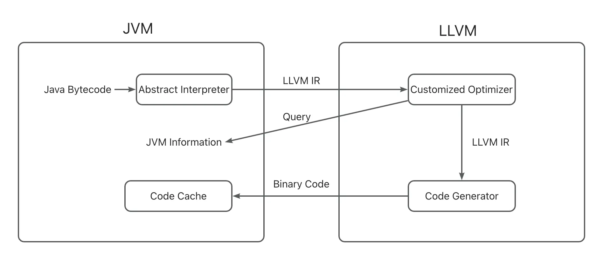

# System Design
## Overview
<p align="center">
  
</p>

Jeandle is set to become a fully-featured JIT compiler, supporting all Java language features such as monitor and exception. Additionally, Jeandle will support compiler features such as deoptimization and on-stack replacement (OSR).

At runtime, Jeandle takes Java bytecodes as input and produces binary code as output. The general workflow of Jeandle is as follows:

1. A Jeandle compilation thread retrieves a compilation task from the task queue and invokes ```JeandleCompiler::compile_method``` to begin a compilation.
2. Bytecodes are translated into LLVM IR through the Abstract Interpreter.
3. A customized optimizer is applied to optimize the IR.
4. The optimized IR is passed to the LLVM backend for code generation.
5. The binary code returned by LLVM code generator is parsed and relocated into the Code Cache, which is used to manage the compiled code for JVM.

## Customized Optimizer
The customized optimizer includes LLVM's standard optimization passes as well as custom optimization passes specifically designed for Java language, such as escape analysis and class analysis.

## Garbage Collection
Jeandle supports the garbage collection mechanism in the HotSpot JVM by leveraging LLVM's statepoint infrastructure. For more information about LLVM's statepoint, refer to the official LLVM documentation:

+ [https://llvm.org/docs/GarbageCollection.html](https://llvm.org/docs/GarbageCollection.html)
+ [https://llvm.org/docs/Statepoints.html](https://llvm.org/docs/Statepoints.html)
